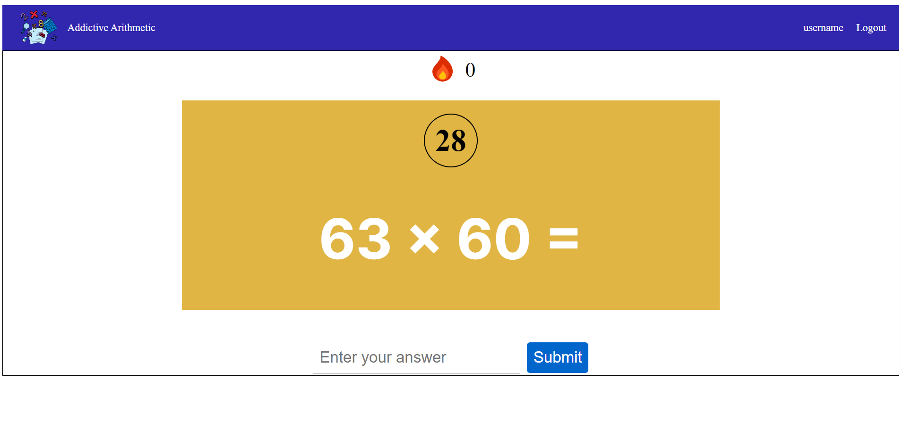
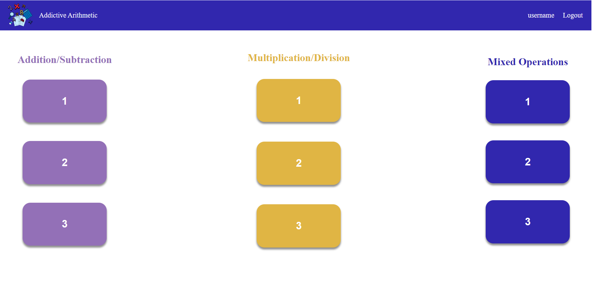
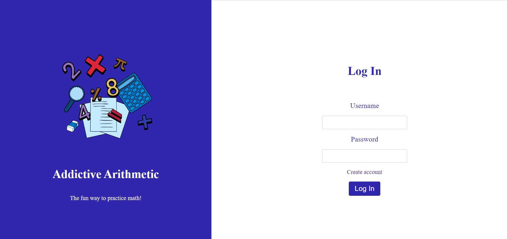
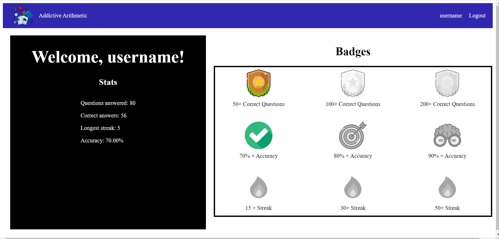
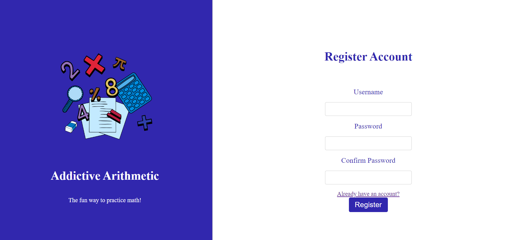

<h1>Addictive Arithmetic</h1>
Addictive Arithmetic is a web application designed to improve mental arithmetic skills through various exercises. The app offers three modes of play: Addition& Subtraction,  Multiplication & Divison, and Mixed Operations, and allows users to choose the difficulty level of the questions.

The application also includes a user authentication system that allows users to create accounts, track their progress, and earn badges.

<h1>Features </h1>
<ul>
  <li> Three modes of play: Addition & Subtraction, Multiplication & Divison, and Mixed Operations </li>
  <li> Three Difficulty levels for each mode. </li>
  <li> User authentication system.</li>
  <li>Progress tracking for individual users. </li>
  <li>Nine badges to try and achieve.</li>
  <li> Responsive design for mobile and desktop.</li>
</ul>

<h1>Technologies Used </h1>
<ul>
  <li> Angular 12</li>
  <li>TypeScript</li>
  <li> Node.js</li>
  <li>Express.js</li>
  <li>PostgreSQL</li>
</ul>

<h1> How to get started locally </h1>
<ol>
  <li> Open up a terminal </li> 
  <li>  Navigate to /backend in the terminal "cd "Math Quiz"/backend" </li> 
  <li> Type in and enter "npm i" </li> 
  <li> Type in and enter "node server.js". </li> 
  <li> Leave the first terminal running, and open up a second terminal. </li> 
  <li> Navigate to /frontend in the second terminal. </li> 
  <li> Type in and enter"npm i" </li> 
  <li> Type in and enter "ng serve" </li> 
  <li> Navigate to "localhost:4200"  </li> 
</ol>

<h1> Screenshots </h1>
<li></li>
<li></li>
<li></li>
<li></li>
<li></li>
